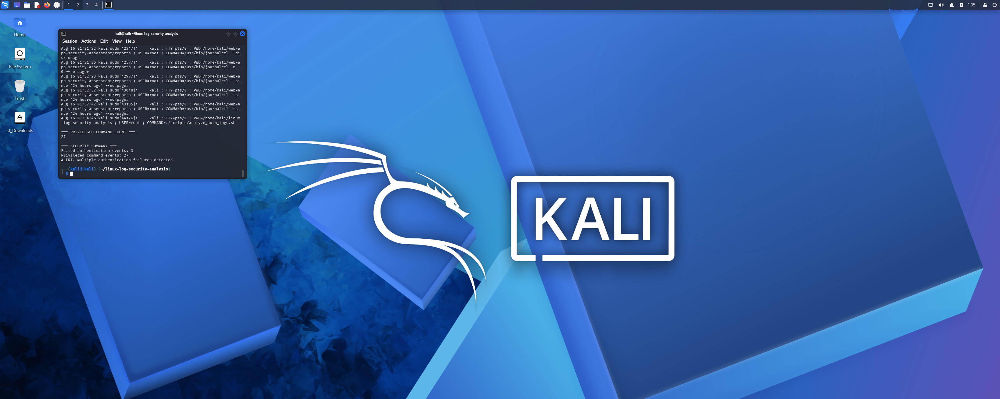
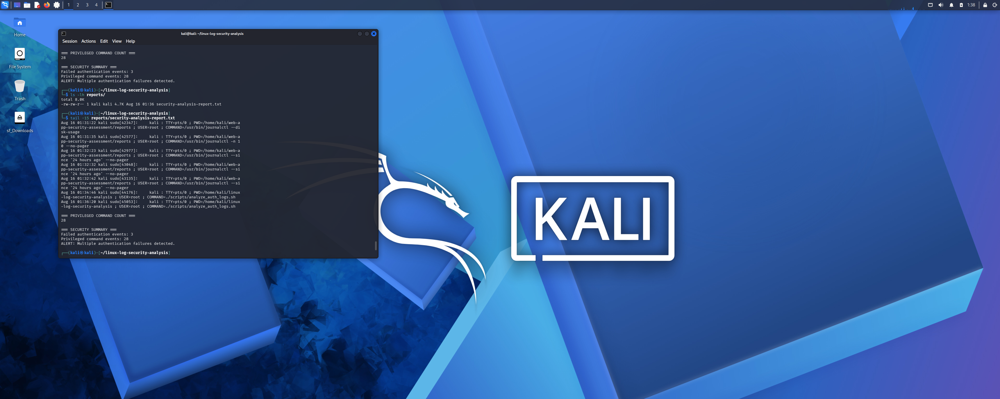
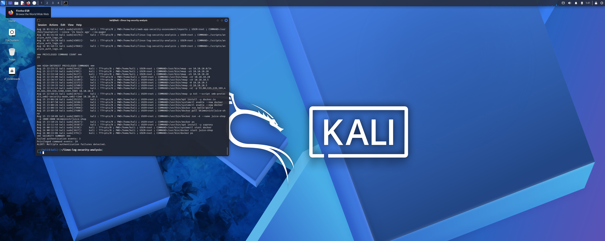

# Linux Log Security Analysis & Automated Detection

A Linux security monitoring project that uses Bash and systemd journal logs to identify authentication failures, privileged command execution, and potentially high-interest administrative activity.

## Project Objective

The goal of this project was to build a lightweight security analysis script that could automatically review Linux system logs, identify security-relevant events, and generate a repeatable security report.

Rather than manually reviewing journal entries, the script performs automated detection and summarizes activity that may warrant further investigation.

## Lab Environment

- Kali Linux
- Bash
- systemd / journalctl
- VirtualBox
- Linux PAM authentication logs
- sudo auditing

## What the Script Detects

The Bash script analyzes the previous 24 hours of system journal activity and identifies:

- Failed authentication attempts
- Password validation failures
- sudo authentication failures
- Privileged command execution
- High-interest administrative and security commands
- Multiple authentication failures exceeding a defined threshold

High-interest activity includes commands associated with:

- Nmap network reconnaissance
- Docker container administration
- systemctl service management
- Package installation
- User and permission management

## Detection Workflow

1. Collect system events using `journalctl`.
2. Search authentication logs for failure indicators.
3. Count failed authentication events.
4. Identify commands executed with elevated privileges.
5. Filter privileged activity for commands of higher security interest.
6. Calculate event totals.
7. Compare authentication failures against an alert threshold.
8. Generate a persistent text-based security report.

## Results

During the analysis, the script identified:

- **3 failed authentication events**
- **31 privileged command events**
- **20 high-interest privileged commands**

The authentication threshold was reached, causing the script to generate:

```text
ALERT: Multiple authentication failures detected.
```

The privileged activity included legitimate lab operations such as Nmap reconnaissance, Docker container management, package installation, and system service administration. This demonstrates why security monitoring requires both automated detection and analyst context: elevated or security-sensitive activity is not automatically malicious.

## Evidence

### Authentication Detection



### Generated Security Report



### High-Interest Command Analysis



### Final Detection Summary


## Repository Structure

```text
linux-log-security-analysis/
├── README.md
├── scripts/
│   └── analyze_auth_logs.sh
├── reports/
│   └── security-analysis-report.txt
└── evidence/
    ├── 01-authentication-detection.png
    ├── 02-security-report-output.png
    ├── 03-high-interest-command-analysis.png
    └── 04-final-detection-summary.png
```

## Skills Demonstrated

- Linux security monitoring
- Log analysis
- Bash scripting
- Detection engineering fundamentals
- Authentication monitoring
- Privileged activity analysis
- systemd journal analysis
- Security event triage
- Alert threshold creation
- Automated security reporting

## Security Analysis

The project demonstrates an important SOC concept: detection alone does not determine whether activity is malicious.

For example, Nmap scans, Docker administration, service modifications, and package installations can represent legitimate administrative activity or potentially suspicious behavior depending on the user, system, timing, and surrounding events.

The script therefore functions as an initial detection and triage mechanism that surfaces activity for analyst review.

## Future Improvements

Potential extensions include:

- IP-based failed-login tracking
- Username-based authentication analysis
- Time-window correlation
- Configurable detection thresholds
- Severity classifications
- CSV or JSON report generation
- Scheduled execution using cron or systemd timers
- SIEM ingestion and visualization
- Email or webhook alerting

## Disclaimer

This project was performed in a controlled lab environment for cybersecurity education and defensive security practice.
